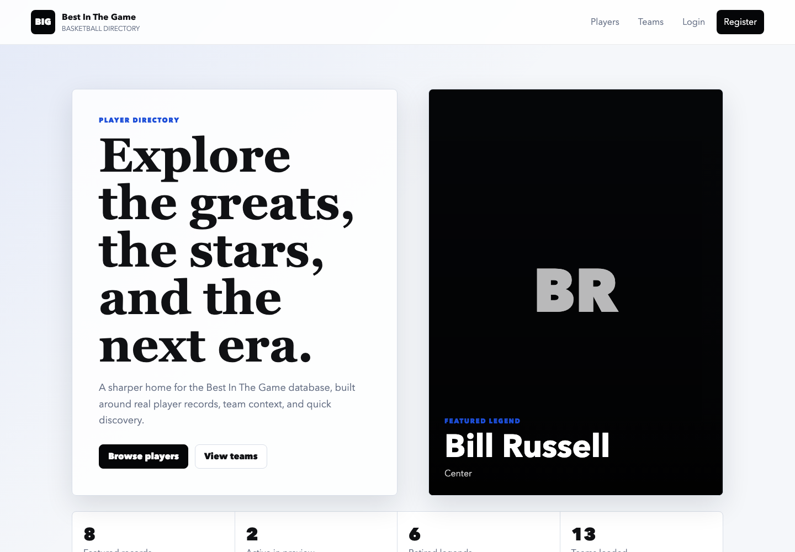
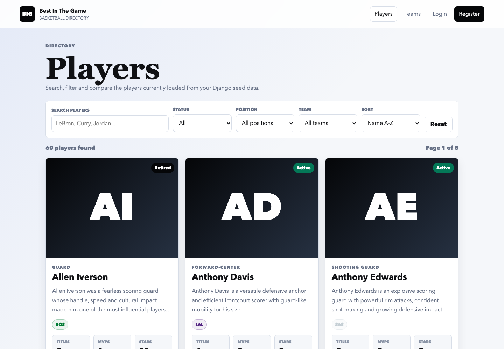
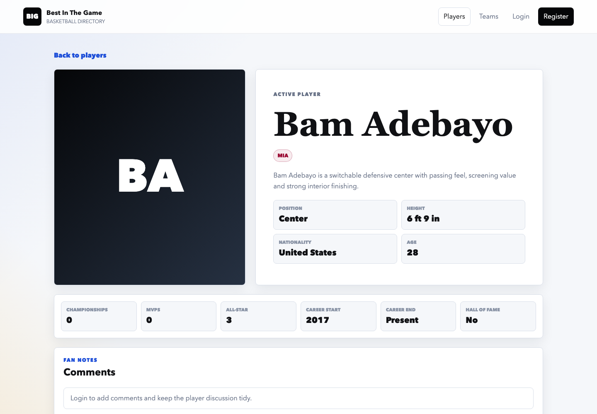
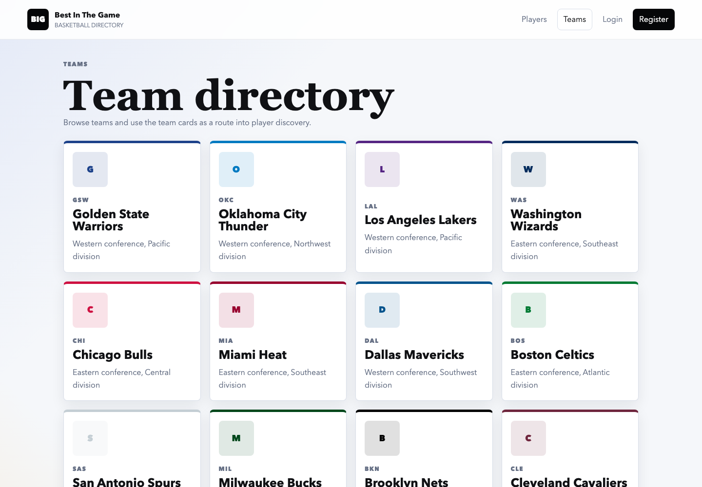

# Best In The Game

Best In The Game is a full-stack basketball directory built with a Django REST Framework API and a React frontend. The original General Assembly SEI project has been revisited and expanded into a more complete player discovery app with richer seed data, filtering, player details, team browsing, authentication, comments, and a Heroku deployment.

Live site: https://best-in-the-game-ac438776330d.herokuapp.com/

GitHub repository: https://github.com/justingrant94/BackEnd--Project4

## Project Overview

The app gives users a clean way to explore basketball players, compare key career information, filter by team/status/position, and leave comments on player pages when authenticated. The backend stores player, team, comment, and user data, while the frontend consumes the API through a Vite React single-page app served by Django in production.

This rebuild focused on keeping the existing Django/React approach, but making the project more complete, presentable, and deployment-ready.

## Screenshots

### Home



### Player Directory



### Player Detail



### Team Directory



## Core Features

- Player directory with 60 seeded player records.
- Team directory with 13 seeded NBA teams.
- Search, pagination, team filtering, position filtering, active/retired filtering, and sorting.
- Player detail pages with bio information, team chips, career metadata, and stat panels.
- JWT authentication for register/login.
- Authenticated commenting on player pages.
- Delete comment endpoint wired through the frontend.
- Image fallback component for remote NBA assets that fail to load.
- Vite React frontend served by Django/WhiteNoise on Heroku.
- Heroku Postgres production database with seed data loaded.

## Tech Stack

### Frontend

- React 18
- Vite
- React Router
- JavaScript
- CSS
- Fetch API

### Backend

- Python 3.12
- Django
- Django REST Framework
- PostgreSQL on Heroku
- SQLite for local development
- PyJWT
- WhiteNoise
- Gunicorn

### Deployment

- Heroku
- Heroku Postgres
- Node buildpack for Vite build
- Python buildpack for Django API

## What Was Improved

The project was expanded from a smaller course submission into a more comprehensive portfolio-ready app.

### Data Model Expansion

The player model now stores richer profile and career information while keeping the original model shape intact.

```python
class Basketball(models.Model):
		names = models.CharField(max_length=100, default=None)
		image = models.CharField(max_length=300, default=None)
		description = models.CharField(max_length=1000, default=None)
		retired = models.BooleanField(default=True)
		age = models.CharField(max_length=100, default=None)
		position = models.CharField(max_length=50, blank=True, null=True)
		height = models.CharField(max_length=50, blank=True, null=True)
		nationality = models.CharField(max_length=100, blank=True, null=True)
		career_start = models.PositiveIntegerField(blank=True, null=True)
		career_end = models.PositiveIntegerField(blank=True, null=True)
		hall_of_fame = models.BooleanField(default=False)
		championships = models.PositiveIntegerField(default=0)
		mvps = models.PositiveIntegerField(default=0)
		all_star_appearances = models.PositiveIntegerField(default=0)
		teams = models.ManyToManyField('teams.Team', related_name='basketball')
```

### API Filtering And Pagination

The player list endpoint now supports query parameters for search, active/retired status, teams, positions, nationality, PPG ranges, sorting, and pagination.

```python
class BasketballListView(APIView):
		permission_classes = (IsAuthenticatedOrReadOnly, )
		pagination_class = BasketballPagination

		def get(self, request):
				basketball = Basketball.objects.prefetch_related('teams').all()

				search = request.query_params.get('search')
				retired = request.query_params.get('retired')
				team = request.query_params.get('team')
				position = request.query_params.get('position')
				sort = request.query_params.get('sort')

				if search:
						basketball = basketball.filter(names__icontains=search)

				if retired in ('true', 'false'):
						basketball = basketball.filter(retired=retired == 'true')

				if team:
						team_filter = Q(teams__name__icontains=team) | Q(teams__abbreviation__iexact=team)
						if team.isdigit():
								team_filter = team_filter | Q(teams__id=int(team))
						basketball = basketball.filter(team_filter)

				if position:
						basketball = basketball.filter(position__icontains=position)
```

### Frontend API Helper

The React app uses one API helper so public requests avoid stale auth headers and protected actions still include the JWT token.

```js
const API_BASE_URL = import.meta.env.VITE_API_BASE_URL || '/api'

export async function apiRequest(path, options = {}) {
	const token = localStorage.getItem('bestInGameToken')
	const headers = {
		'Content-Type': 'application/json',
		...options.headers,
	}

	if (token && options.auth !== false) {
		headers.Authorization = `Bearer ${token}`
	}

	const response = await fetch(`${API_BASE_URL}${path}`, {
		...options,
		headers,
	})

	const data = await response.json().catch(() => null)

	if (!response.ok) {
		const message = data?.detail || data?.message || data?.Message || 'Something went wrong.'
		throw new Error(message)
	}

	return data
}
```

### Player Directory UI

The player page keeps filters in React state and reloads the API whenever the filter state changes.

```jsx
useEffect(() => {
	async function loadPlayers() {
		setLoading(true)
		setError('')

		try {
			const data = await getPlayers({ ...filters, page_size: 12 })
			setPlayers(data.results || data)
			setCount(data.count || data.length || 0)
		} catch (err) {
			setError(err.message)
		} finally {
			setLoading(false)
		}
	}

	loadPlayers()
}, [filters])
```

### Commenting

Authenticated users can post comments from the player detail page. The UI calls the API and reloads the player detail data after changes.

```jsx
async function handleSubmit(event) {
	event.preventDefault()
	setError('')

	if (!text.trim()) {
		setError('Add a comment before posting.')
		return
	}

	try {
		setSubmitting(true)
		await createComment({ text, basketball: playerId })
		setText('')
		onChanged()
	} catch (err) {
		setError(err.message)
	} finally {
		setSubmitting(false)
	}
}
```

### JWT Authentication Fix

The login endpoint now stores the JWT subject as a string, which keeps it compatible with the PyJWT version used in the project.

```python
token = jwt.encode(
		{
				'sub': str(user_to_validate.id),
				'exp': int(dt.strftime('%s'))
		},
		settings.SECRET_KEY,
		algorithm='HS256'
)
```

### Deployment Configuration

Django now reads production values from Heroku config vars, uses `DATABASE_URL` for Heroku Postgres, and serves the Vite build through WhiteNoise.

```python
SECRET_KEY = os.environ.get('SECRET_KEY', 'local-dev-secret-key')
DEBUG = os.environ.get('DEBUG', 'True') == 'True'
ALLOWED_HOSTS = ['localhost', '127.0.0.1', '.herokuapp.com']

DATABASES = {
		'default': dj_database_url.config(
				default=f"sqlite:///{BASE_DIR / 'db.sqlite3'}"
		)
}

STATIC_URL = '/static/'
STATIC_ROOT = BASE_DIR / 'staticfiles'
STATICFILES_DIRS = [
		('assets', BASE_DIR / 'client' / 'dist' / 'assets'),
]
```

Vite builds static assets using `/static/` so the deployed Django app can serve the React bundle correctly.

```js
export default defineConfig({
	base: '/static/',
	plugins: [react()],
	server: {
		proxy: {
			'/api': 'http://127.0.0.1:8000',
		},
	},
})
```

## API Endpoints

| Method | Endpoint | Description |
| --- | --- | --- |
| `GET` | `/api/basketball/` | List players with pagination and filters |
| `GET` | `/api/basketball/:id/` | Get a populated player detail record |
| `GET` | `/api/teams/` | List teams with related players |
| `POST` | `/api/auth/register/` | Register a new user |
| `POST` | `/api/auth/login/` | Login and receive a JWT |
| `GET` | `/api/auth/profile/` | Return the authenticated user profile |
| `POST` | `/api/comments/` | Create a comment for a player |
| `DELETE` | `/api/comments/:id/` | Delete a comment |

Example player filter request:

```txt
/api/basketball/?search=jordan&retired=true&team=CHI&sort=-championships&page_size=12
```

## Local Setup

Clone the repository and install backend dependencies.

```bash
git clone https://github.com/justingrant94/BackEnd--Project4.git
cd BackEnd--Project4
python3 -m venv .venv
source .venv/bin/activate
pip install -r requirements.txt
```

Run migrations and seed the database.

```bash
python manage.py migrate
python manage.py loaddata teams/seeds.json
python manage.py loaddata basketball/seeds.json
```

Install frontend dependencies and run the Vite dev server.

```bash
cd client
npm install
npm run dev
```

In a second terminal, run Django.

```bash
source .venv/bin/activate
python manage.py runserver
```

The Vite dev server proxies `/api` requests to Django at `http://127.0.0.1:8000`.

## Deployment Notes

The app is deployed as a single Heroku app. Node builds the Vite frontend first, then Python installs Django dependencies and collects static files.

Root `package.json`:

```json
{
	"scripts": {
		"heroku-postbuild": "cd client && npm install --include=dev && npm run build"
	},
	"engines": {
		"node": "22.x"
	}
}
```

`Procfile`:

```Procfile
web: gunicorn project.wsgi:application
```

Heroku config required:

```bash
heroku config:set DEBUG=False --app best-in-the-game
heroku config:set SECRET_KEY="your-production-secret" --app best-in-the-game
```

Production database setup:

```bash
heroku run python manage.py migrate --app best-in-the-game
heroku run python manage.py loaddata teams/seeds.json --app best-in-the-game
heroku run python manage.py loaddata basketball/seeds.json --app best-in-the-game
```

## Challenges Solved During The Rebuild

- The project originally had no working React frontend in the `client` folder, so a new Vite React app was built around the existing API.
- The seed data was expanded to 60 player records and 13 team records without rewiring the existing model relationships.
- Public API requests were updated so stale local tokens do not break unauthenticated browsing.
- JWT `sub` values were changed to strings to satisfy the current PyJWT expectations.
- Heroku deployment was updated from Django `runserver` to Gunicorn.
- The repo was moved from Pipenv deployment markers to `requirements.txt` because Heroku now rejects multiple Python package manager files.
- Heroku buildpacks were ordered so Node builds the Vite frontend before Django collects static files.
- Vite asset paths were aligned with Django static serving so the deployed React app loads correctly.
- Remote image failures are handled with a reusable `SafeImage` fallback component.

## Future Improvements

- Add edit functionality for comments.
- Add owner-only conditional rendering for comment delete buttons.
- Add richer stat comparison views between players.
- Add more advanced filters for career years, Hall of Fame status, awards, and nationality.
- Replace remote image URLs with stored, reliable image assets or a managed media service.
- Add automated frontend tests for filtering and auth workflows.

## Wins And Key Learnings

- The project now has a complete full-stack deployment with Django, React, Vite, Heroku, and Postgres working together.
- The API is more useful because it supports practical search, filtering, sorting, and pagination.
- The frontend is more comprehensive and easier to navigate, with separate home, players, teams, auth, and detail views.
- Deployment taught the importance of matching frontend asset paths, backend static settings, and Heroku buildpack order.
- Keeping the original approach while improving the structure made the project stronger without turning it into a completely different app.


